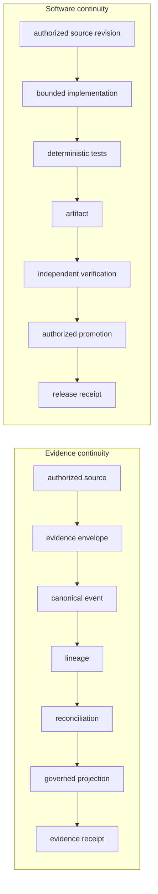

# SEATRACE:CONTINUITY-PACKET:v002

Shared open Packet Handler understanding for Commons-Good teammates.

**Orders:** TAMMY001-SO-v002 (core laws unchanged)
**Kind:** DESIGN-CANDIDATE
**Posture:** HOLD-PRESERVE-CANDIDATE
**Authorization:** HOLD-AUTHORIZATION
**Execution authority:** none
**001A:** nominated only — not run, not authorized

v002 is the superseding candidate. This pass does not change its core laws.
It makes the DevOps continuity plane explicit so the software that implements
SeaTrace is governed by the same continuity doctrine as the seafood evidence.

Insert **after** the machine-readable compiler and **before** the job
sequence. Do not add another 001 letter. Do not disturb 001A–001K.

Section **14A** (DevOps Continuity and Evidence ETL) is folded in.
Teammate restatement, graded: [14A-DEVOPS-ETL.md](./14A-DEVOPS-ETL.md).

## Machine-readable compiler

```
SEATRACE:CONTINUITY-PACKET:v002
kind: DESIGN-CANDIDATE
posture: HOLD-PRESERVE-CANDIDATE
authorization: HOLD-AUTHORIZATION
orders: TAMMY001-SO-v002
handler: Packet Handler
acting_master: 1
execution_authority: none
rails: PUBLIC | COMPLIANCE | PRIVATE | SHARED_METADATA
subject_public: UNKNOWN
subject_private: UNKNOWN
census_001A: NOMINATED
jobs_001B_001K: NOT_COMPLETE
job_001J: NOT_COMPLETE
section: 14A
planes: EVIDENCE | SOFTWARE
planes_borrow: forbidden
both_green: required
commit: not-receipt
build: not-verification
push: not-promotion
deploy: not-correct-deployment
http_200: not-correct-body
private_truth: not-public-disclosure
preflight: read-only-no-repo-files
etl: extract-normalize-load-reconcile-project-verify
etl_destructive: forbidden
second_writer: forbidden
existence_in_git: not-adoption
existence_in_db: not-adoption
pattern_library: not-inherited-checkmarks
```

Exact repository / ref / SHA remain **UNKNOWN** on this public record.
UNKNOWN is the lawful public default. KNOWN is a private-event promotion
from fetched bytes — never a chat claim.

## Law

A traceability event without lineage is incomplete.

A code commit without an accountable receipt is also incomplete.

Neither existence in a database nor existence in Git equals adoption.

Both planes must be green. One green plane does not adopt the other.

```
COMMIT != RECEIPT
BUILD != VERIFICATION
PUSH != PROMOTION
DEPLOY != CORRECT DEPLOYMENT
HTTP_200 != CORRECT BODY
PRIVATE TRUTH != PUBLIC DISCLOSURE
```

A software commit may exist while remaining IMPLEMENTED, UNRECEIPTED,
UNVERIFIED, and UNADOPTED. Existence is not adoption.

## Two continuity planes



| Plane | Flow |
|---|---|
| Evidence | authorized source → evidence envelope → canonical event → lineage → reconciliation → governed projection → evidence receipt |
| Software | authorized source revision → bounded implementation → deterministic tests → artifact → independent verification → authorized promotion → release receipt |

## Public state context vs private event logic

This is the UNKNOWN → KNOWN rule.

| Context | Knowledge now | Law |
|---|---|---|
| **Public state** (campaign copy, Commons record, MSC site) | UNKNOWN | Repository, fully qualified ref, and SHA stay UNKNOWN. Naming a public repo as a *lane* is allowed. Echoing a private SHA is not. UNKNOWN here is correct, not a missing field. |
| **Private event logic** (harness, graph, review receipts) | UNKNOWN | Starts UNKNOWN. Becomes KNOWN only from fetched bytes that bind repository + fully qualified ref + full SHA. VERIFIED-REPORTED is not KNOWN. Bare `main` is never KNOWN. |

UNKNOWN → KNOWN is a Packet Handler event with lineage. It is not a chat
claim, a Git log anecdote, or a precursor checkmark.

Public and private may share a CID. They are not co-authoritative packets.
A generator does not emit both rails.

## Four rails

| Rail | Role |
|---|---|
| PUBLIC | Allowlist-first disclosure. Stands alone. Never implies a private fact. No ingress or query path to the private canonical ledger. |
| COMPLIANCE | Regulator-facing representation. Authorities live here — not a fifth storage rail. Not public. |
| PRIVATE | Event logic, graph, harness, settlement, margin, price. Below the waterline. |
| SHARED_METADATA | Pairing information, hashes, versions, timestamps, counts, classifications, verdicts, and approved redaction metadata only. |

## What checks off, and what does not

Predecessor-team work is a **pattern library and evidence lineage**. It is
not a bucket of green checkmarks that transfers into v002.

| Control | State now | Reason |
|---|---|---|
| One Acting Master / one canonical Packet Handler | DESIGN LAW | Prevents specialty agents becoming competing ledger writers. |
| Four-pillar evidence ordering | DESIGN LAW | EM observation → ER assertion → receiving measurement → approved MarketSide derivative. |
| PUBLIC / COMPLIANCE / PRIVATE / SHARED_METADATA | DESIGN LAW | Four rails. PUBLIC has no ingress to the private ledger. Regulators are authorities inside COMPLIANCE. |
| rail ≠ pairing handle ≠ crypto key ≠ authority_token | DESIGN LAW | Four unrelated concepts must not collapse into “keys.” |
| Append corrections instead of overwrite | DESIGN LAW | Continuity semantics. Preserve prior receipts. Add a correction edge. |
| ETL without destructive transformation | DESIGN LAW | Normalize and reconcile create events. They never silently overwrite source evidence. |
| Neither plane borrows completion | DESIGN LAW | COMMIT ≠ RECEIPT. BUILD ≠ VERIFICATION. PUSH ≠ PROMOTION. HTTP_200 ≠ CORRECT BODY. |
| Atomic event + lineage + outbox | TARGET CONTRACT | Strong. Not verified on the nominated harness path. |
| Deterministic content hash vs issued envelope hash | TARGET CONTRACT | Right abstraction. Canonical byte encoding still belongs to 001D. |
| Mass balance / forecast error / economics formulas | SPECIFIED | Gated by Owner-ratified tolerances and real comparable baselines. |
| Previous dispatcher ValidateOnly / prior test work | VERIFIED-REPORTED PRECURSOR | Reusable pattern. Cannot check off a harness job without current repo/ref/hash evidence. |
| Earlier Level-0 wrong-root detection | VERIFIED-REPORTED PRECURSOR | Belongs inside 001A. Not already passed for this nominated path. |
| Prior Git / ledger mismatch findings | DESIGN INPUT | Why commit continuity and receipt continuity need separate gates. Not proof about this path. |
| 001A repository census | NOT RUN / NOT AUTHORIZED | Nominated only. No execution authority implied. |
| 001B–001K | NOT COMPLETE | None may inherit success from preceding repositories or agents. |
| Real 001 operating unit | NOT PROVEN | An evidentiary operating unit — not a production or fleet claim. |

## Evidence ETL + Reconcile + Project + Verify

SeaTrace retains the established ETL concept but applies it without
destructive transformation. Receipts terminate each plane. They are not
a seventh ETL rewrite step.

**EXTRACT**
Adapters may read only authorized sources. Nothing is promoted merely
because it was observed or parsed.

**NORMALIZE**
Identifiers, units, schemas, authority references, evidence classes, and
deterministic representations may be standardized. Original source
identity and digest remain preserved. Never silently overwrite source
evidence.

**LOAD**
Only the Packet Handler atomically commits: canonical event + typed
LineageEdge + outbox. No specialty agent, adapter, generator, projector,
verifier, UI, or public service becomes a second canonical writer.

**RECONCILE**
Later evidence may CONFIRM, DISPUTE, CORRECT, SUPERSEDE, RECONCILE, or
BLOCK through new events. Never erase historical evidence.
Transformation reconciliation uses Owner-ratified unit, loss taxonomy,
WIP treatment, rounding rule, and tolerance.

**PROJECT**
The outbox is the asynchronous boundary. PUBLIC consumes approved
projection inputs only and has no ingress to the private canonical
ledger.

**VERIFY**
Far-side readback proves subject identity, hashes, schema, policy,
verdict, and code SHA / artifact digest when software is produced.
A local write, commit, push, build, HTTP 200, or deploy command is not
completion.

Field-level duties live in [14A-DEVOPS-ETL.md](./14A-DEVOPS-ETL.md).
Values stay UNKNOWN on this public record.

Receipt canonicalization precedes receipt-producing tests.
001A–001C are genuinely read-only when authorized.

## Defect classes

Git can know something happened while the governance ledger cannot account
for it. That is a deterministic defect class, not an anecdote.

| Class | When |
|---|---|
| `CODE_WITHOUT_RECEIPT` | Git knows a commit happened. The governance ledger cannot account for it. |
| `RECEIPT_WITHOUT_SUBJECT` | A receipt exists without bound repository / ref / full SHA. |
| `RECEIPT_SUBJECT_MISMATCH` | The receipt subject is not the fetched bytes it claims. |
| `UNVERIFIED_IMPLEMENTATION` | A design or precursor pattern is offered as proof of this path. |
| `UNAUTHORIZED_PROMOTION` | UNKNOWN is treated as KNOWN, or ADOPTED, without Owner GO. |
| `DEPLOYMENT_BINDING_UNKNOWN` | A deploy or projection cannot name the artifact / policy / subject it bound. |
| `RECEIPT_CHAIN_BREAK` | A receipt sequence cannot name prior_receipt_hash or genesis. |
| `EVENT_WITHOUT_LINEAGE` | A canonical event was accepted without a typed LineageEdge. |
| `LINEAGE_WITHOUT_EVENT` | A lineage edge exists without the event it claims to bind. |
| `OUTBOX_WITHOUT_ACCEPTED_EVENT` | An outbox record exists without an accepted canonical event. |
| `PROJECTION_WITHOUT_SOURCE_RECEIPT` | A projection was emitted without a source receipt. |
| `PUBLIC_PROJECTION_RECONSTRUCTS_PRIVATE` | Public representation reconstructs a private value. |
| `SELF_VERIFIED_IMPLEMENTATION` | The builder verifies or authorizes its own work. |
| `CANONICAL_REQUIRED_ARTIFACT_UNACCOUNTED` | A required artifact has no canonical home and no authorized exclusion. |

## authority_token

Keep the v002 distinction. Define it as an **authorization reference**, not
a secret bearer credential. Otherwise a future agent may read it as
OAuth / JWT / API-token material.

```
authority_token =
a bounded reference proving authorization for one named action;
it is not cryptographic key material and must not contain a secret
credential unless separately classified and handled as PRIVATE.
```

| Name | Is | Is not |
|---|---|---|
| rail | PUBLIC, COMPLIANCE, PRIVATE, or SHARED_METADATA | Not a pairing handle. Not a key. Not an authority. |
| pairing handle | A correlating name between seats or systems | Not a key. Not an authority. |
| crypto key | Cryptographic material. PRIVATE unless separately classified | Not a pairing handle. Not an authority_token. |
| authority_token | Bounded reference for one named action | Not OAuth / JWT / API-secret unless classified PRIVATE. |

## Level 0 belongs inside 001A

001A is already the repository census. Preceding work shows why it must
also observe the Git root. A legitimate command from the wrong inherited
Git root invalidates everything downstream.

This is **not** a new 001 letter. It does not disturb 001A–001K.

When Git is the tool in that environment, use porcelain intended for
scripts and stable across Git versions and configuration. v2 supplies
branch / upstream data. NUL-terminated paths avoid pathname parsing
ambiguity.

Every field starts **UNKNOWN** on this public packet. REQUIRED is the
duty when 001A is authorized in private event logic:

| Field | Duty | Public knowledge |
|---|---|---|
| authorized_root | REQUIRED | UNKNOWN |
| repository_root | REQUIRED | UNKNOWN |
| parent_git_boundary | REQUIRED | UNKNOWN |
| repository_identity | REQUIRED | UNKNOWN |
| repository_visibility | OBSERVE_IF_AUTHORIZED | UNKNOWN |
| remote_identity | REQUIRED | UNKNOWN |
| default_branch | OBSERVE | UNKNOWN |
| current_ref | REQUIRED | UNKNOWN |
| full_sha | REQUIRED | UNKNOWN |
| upstream | OBSERVE | UNKNOWN |
| worktrees | REQUIRED | UNKNOWN |
| tracked_change_state | REQUIRED | UNKNOWN |
| untracked_state | REQUIRED | UNKNOWN |
| ignored_state | REQUIRED_WHEN_RELEVANT | UNKNOWN |
| applicable_instruction_files | REQUIRED | UNKNOWN |
| tool_versions | REQUIRED | UNKNOWN |
| expected_history_relationship | OBSERVE_WHEN_NOMINATED | UNKNOWN |
| result | PASS_OR_BLOCK | UNKNOWN |

## Job sequence (still not run)

| Job | Title | State | Mode |
|---|---|---|---|
| 001A | Repository census + Level-0 observations | NOMINATED · NOT RUN · NOT AUTHORIZED | read-only when authorized — no repo files as proof |
| 001B | Read-only follow-on (named in candidate) | NOT COMPLETE | read-only |
| 001C | Read-only follow-on (named in candidate) | NOT COMPLETE | read-only |
| 001D | Canonical byte encoding (content hash vs envelope hash) | NOT COMPLETE | not started |
| 001J | Failure recovery | NOT COMPLETE | named coverage — not run, not inherited |
| 001E–001I · 001K | Remaining sequence | NOT COMPLETE | none inherit success |

This packet ends at HOLD-AUTHORIZATION. 001A is merely nominated.

## Ask when

- SO-02: public state would name a private SHA, lot, AIS, buyer, or COC.
- SO-03: private event logic claims KNOWN without fetched repo / ref / full SHA.
- SO-04: a precursor SHA or suite pass is inherited as proof of this path.
- SO-05: UNKNOWN is promoted to ADOPTED or SEND-IT without Owner GO.
- SO-07: a specialty agent writes the ledger, or a generator emits both rails.
- SO-09: Git existence is offered as a receipt, or a receipt has no subject.
- 001A: a command may be running from the wrong inherited Git root.
- 001A: a preflight would create repository files as proof that it ran.
- TOKEN: authority_token is treated as OAuth / JWT / API-secret material.
- 14A: a plane borrows completion from the other, or HTTP 200 is treated as a correct body.
- 14A: a required artifact is untracked or local-only with no canonical home.
- 14A: the builder verifies or authorizes itself.
- 14A: normalization or reconcile would silently overwrite source evidence.
- 14A: a specialty agent, UI, or public service becomes a second canonical writer.

## Terminals this seat will not print

COMPLETE, MERGE_READY, APPROVED, ADOPTED.

v003 remains: ARCHITECTURE-ALIGNED CANDIDATE · RATIFICATION BLOCKED ·
IMPLEMENTATION UNVERIFIED.
